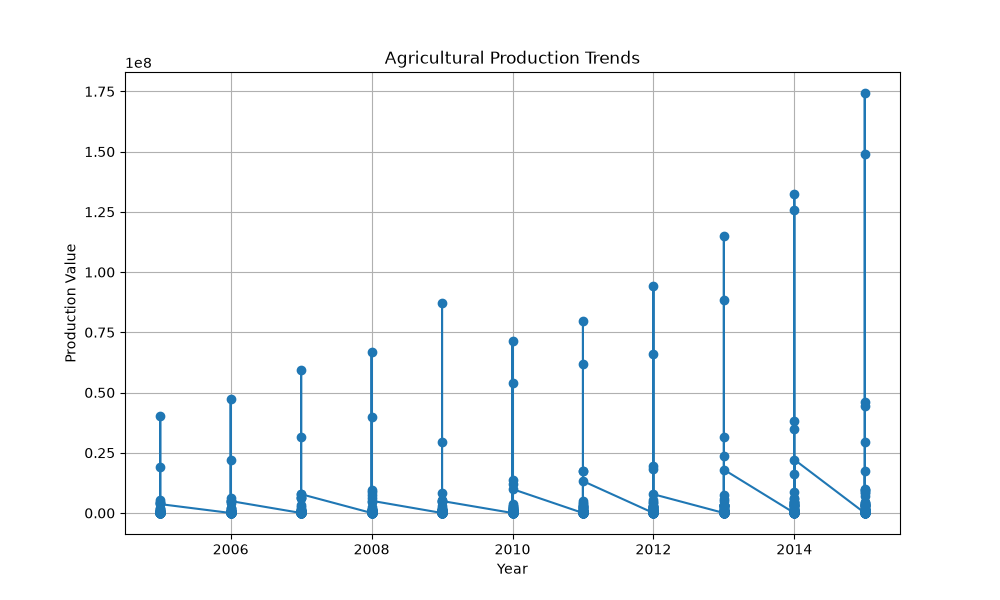
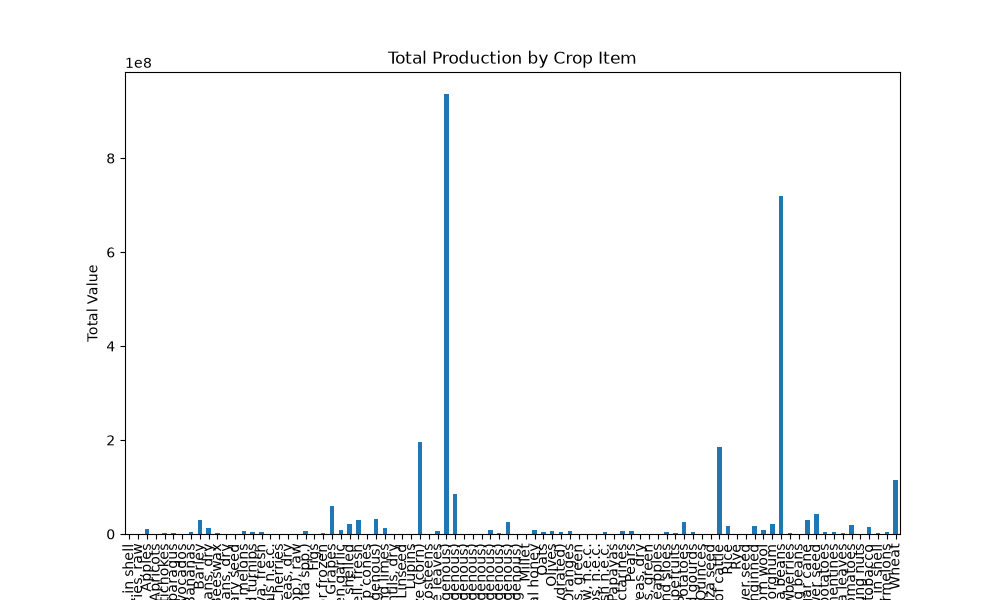

# Capstone Project: Climate Impacts on Regional Agricultural Yields
**Author:** Bensoni Benjamini  
**Registration Number:** [BPE/D2024/0003]  
**Course Code:** AGE 219

## 1. Problem Statement
This project evaluates the correlation between seasonal temperature shifts and regional crop yields to optimize production scheduling under changing climates.

## 2. Data Source
Mined 10 distinct historical data files (.csv format) tracking annual crop yields and local weather station sensor grids.

## 3. Methodology
* **Pandas:** Programmatically consolidated data files, removed records containing missing elements, and used group-by tracking to evaluate regional variations.
* **SciPy:** Executed linear regression models to determine the coefficient of determination (R-value) and statistical significance.

## 4. Results & Conclusion
The analytical model demonstrates a pronounced correlation where optimized temperature windows heavily dictate yield performance.

### 

---
@kadefue

